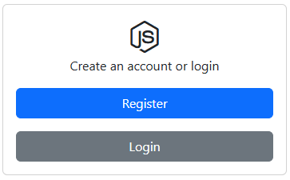
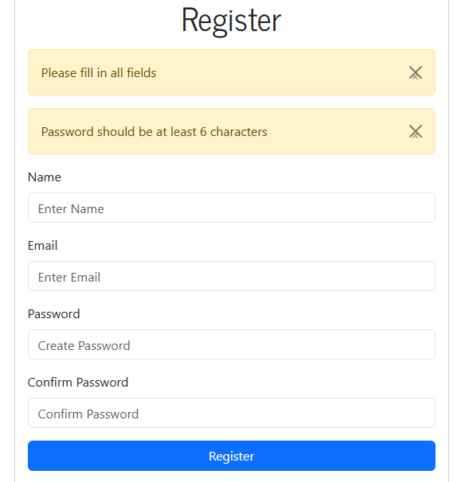
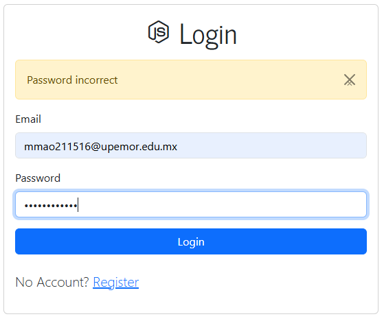
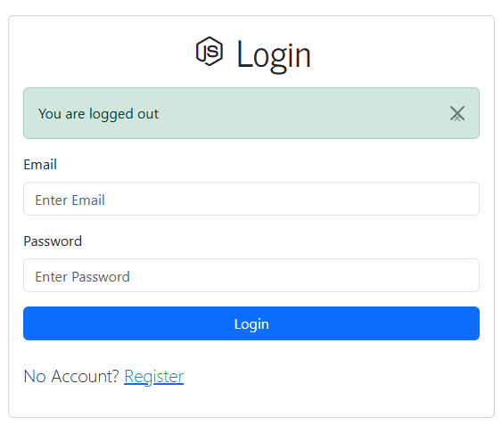
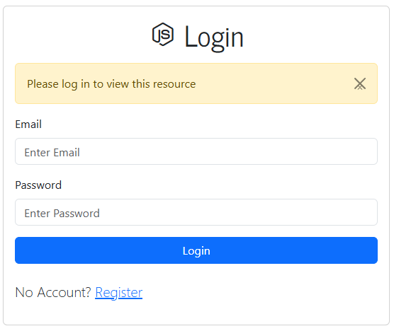

# sistemaDeAcceso
Sistema de inicio de sesión y registro de usuarios utilizando Node.js, Express, Passport, bcrypt y Mongoose.

Vista Principal de Login

Vista Principal de Registro

Vista Principal de Acceso

Vista de Cierre de Sesión

Vista de Acceso no autorizado

